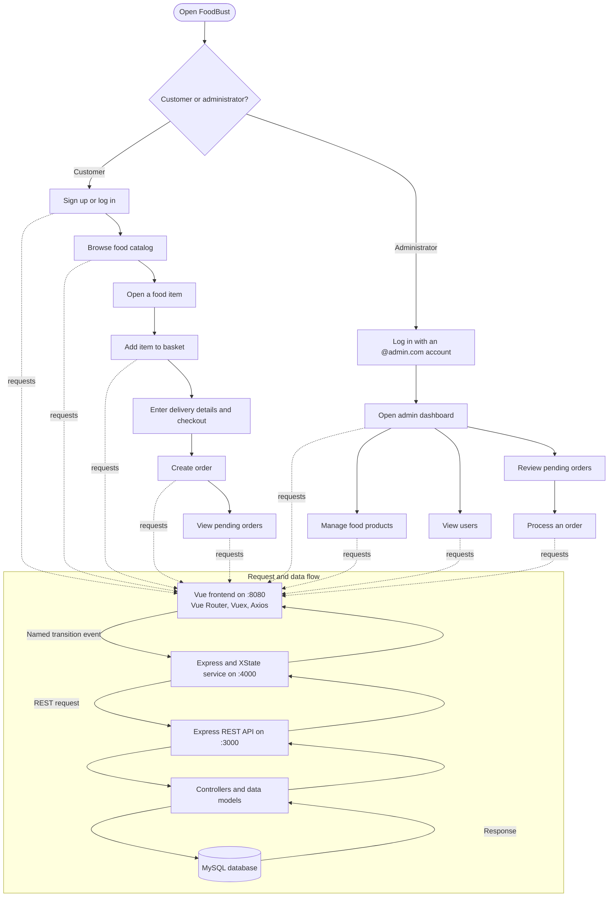

# FoodBust Food Delivery Website

FoodBust is a food-ordering web application with customer and administrator workflows. Customers can browse a menu, add food to a basket, place orders, and check their pending orders. Administrators can manage menu products and users and process incoming orders.

The application is split into three services: a Vue frontend, an Express/XState transition service, and an Express REST API backed by MySQL.

## Research Question

**How can explicit state machines coordinate customer and administrator workflows across a food-ordering application's frontend, API, and database?**

**Answer:** FoodBust models frontend requests as named events such as `LOGIN`, `GET_PRODUCTS`, `ORDER`, and `PROCESS_ORDER`. The Vue application sends each event to the XState service, which runs the corresponding state transition and calls the REST API. The REST API reads or updates MySQL, then the response returns through the state machine to Vuex and the relevant screen. This makes the application's request paths and outcomes explicit. The project demonstrates this architecture; it does not include a performance or usability evaluation.

## Features

- Customer registration and login
- Food catalog and product detail pages
- Basket management and order placement
- Customer view of pending orders
- Administrator product creation, editing, and deletion
- Administrator user list and pending-order processing
- Vuex state management and XState request workflows

## Application Flow



The checkout form currently simulates payment in the browser. It does not charge a card or connect to a payment provider.


## Technology

- **Frontend:** Vue 2, Vue Router, Vuex, Axios, Tailwind CSS
- **Transition service:** Node.js, Express, XState
- **REST API and persistence:** Node.js, Express, MySQL (`mysql2`)

## Run Locally

### Requirements

- Node.js and npm
- MySQL

The repository has separate package files for `frontend`, `fsm`, and `backend`; install and run each service from its own directory. The frontend expects the FSM service on port `4000`, and the FSM service calls the REST API on port `3000`.

### 1. Clone the repository

```bash
git clone https://github.com/hassaan4717/FoodBust_food_delivery_website.git
cd FoodBust_food_delivery_website
```

### 2. Create the MySQL database

The repository does not include a database schema or seed data. Create a database named `foodbust` and tables compatible with the queries below before starting the services. This schema follows the columns used by the current models:

```sql
CREATE DATABASE foodbust;
USE foodbust;

CREATE TABLE users (
	id VARCHAR(36) PRIMARY KEY,
	name VARCHAR(255) NOT NULL,
	email VARCHAR(255) NOT NULL UNIQUE,
	password VARCHAR(255) NOT NULL
);

CREATE TABLE products (
	id VARCHAR(36) PRIMARY KEY,
	code VARCHAR(100) NOT NULL,
	name VARCHAR(255) NOT NULL,
	price DECIMAL(10, 2) NOT NULL,
	is_ready TINYINT(1) NOT NULL DEFAULT 1,
	gambar VARCHAR(255) NOT NULL
);

CREATE TABLE baskets (
	id VARCHAR(36) PRIMARY KEY,
	user_id VARCHAR(36) NOT NULL,
	product_id VARCHAR(36) NOT NULL,
	total_booking INT NOT NULL,
	description TEXT,
	FOREIGN KEY (user_id) REFERENCES users(id),
	FOREIGN KEY (product_id) REFERENCES products(id)
);

CREATE TABLE orders (
	id VARCHAR(36) PRIMARY KEY,
	user_id VARCHAR(36) NOT NULL,
	table_no VARCHAR(255) NOT NULL,
	created_at TIMESTAMP NOT NULL DEFAULT CURRENT_TIMESTAMP,
	FOREIGN KEY (user_id) REFERENCES users(id)
);

CREATE TABLE order_items (
	id VARCHAR(36) PRIMARY KEY,
	order_id VARCHAR(36) NOT NULL,
	product_id VARCHAR(36) NOT NULL,
	total_booking INT NOT NULL,
	description TEXT,
	FOREIGN KEY (order_id) REFERENCES orders(id),
	FOREIGN KEY (product_id) REFERENCES products(id)
);
```

Add product rows before ordering. Product image values in `gambar` should match image filenames available under `frontend/public/assets/images/`.

### 3. Configure the database connection

Create `backend/.env` with credentials for your MySQL instance:

```dotenv
DB_HOST=localhost
DB_PORT=3306
DB_USER=root
DB_PASS=your_mysql_password
DB_NAME=foodbust
```

### 4. Install dependencies

Run each command in a separate terminal from the repository root:

```bash
cd backend
npm ci
```

```bash
cd fsm
npm ci
```

```bash
cd frontend
npm ci
```

### 5. Start the services

Start each service in a separate terminal, from the repository root:

```bash
cd backend
npm start
```

```bash
cd fsm
npm start
```

```bash
cd frontend
npm run serve
```

Open the frontend at [http://localhost:8080](http://localhost:8080). The backend listens on `http://localhost:3000`, and the XState transition service listens on `http://localhost:4000`.

## Using the Application

- Register a customer account or log in with an existing account.
- The administrator login screen accepts accounts whose email ends in `@admin.com`; the application uses this suffix to select the admin interface.
- Browse the menu, open a product, add it to the basket, and submit an order. Entered card details are not sent to a payment service.
- Administrators can add, update, and remove products, view registered users, and process pending orders.

## Project Structure

```text
backend/   Express REST API, controllers, MySQL models, and database connection
fsm/       Express service that interprets XState transitions and calls the REST API
frontend/  Vue application, routes, Vuex store, screens, and static food images
```

## Limitations and Security

- This is a development/demo application, not a production ordering or payment system.
- The checkout form only simulates a successful payment; no payment is authorized or captured.
- The current user controller stores and compares passwords as plain text. Do not use real or reused passwords.
- Admin routing is based on an email suffix in the frontend; the API does not enforce administrator authorization. Do not expose these services to untrusted users.
- The project does not include automated tests or database seed data.
